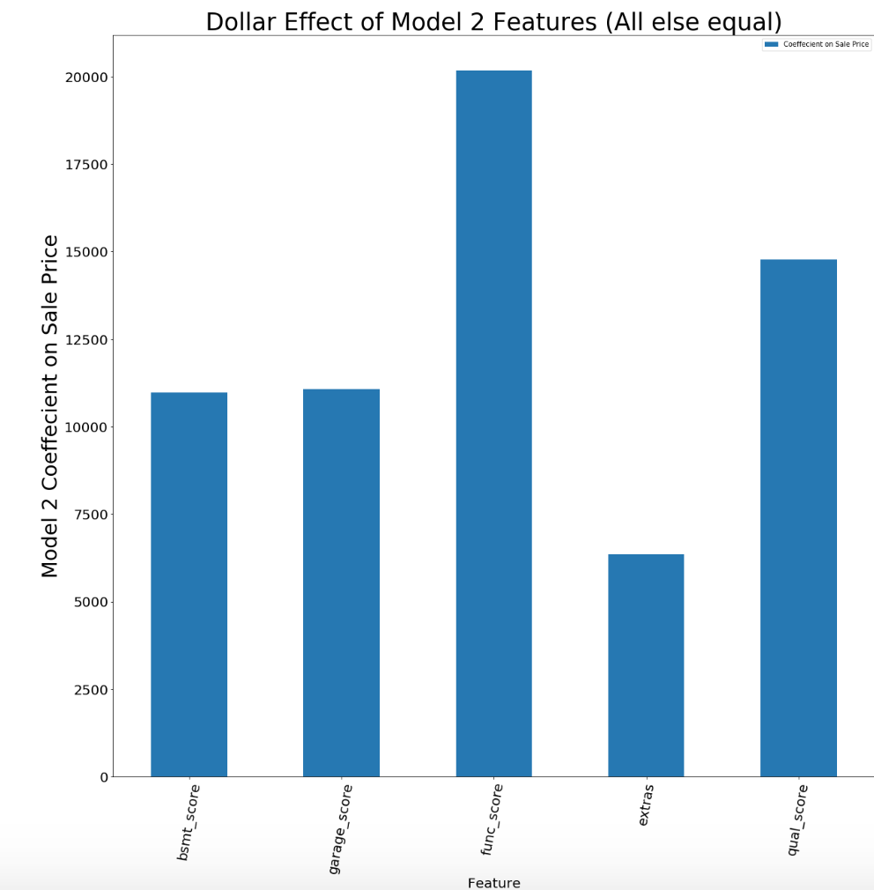
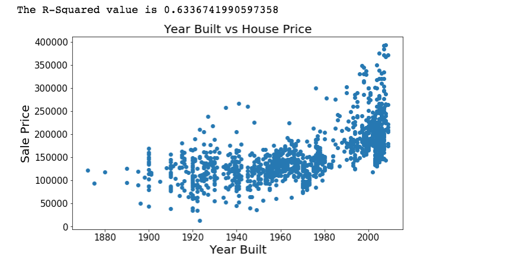
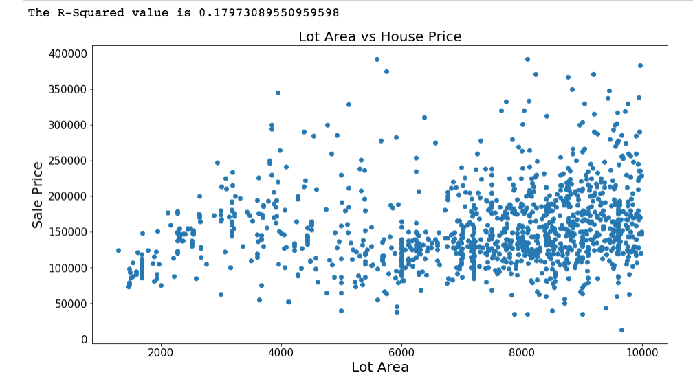

# Optimal Real Estate Investment in Ames, Iowa


# README Contents

- [Introduction](#introduction) 
- [Methodology](#methodology)
- [Data Dictionary Used](#Datasets_Used)
- [Analysis and Findings](#analysis)
    - [Comparison of Regressions for Models](#regressions)
    - [Coeffecients on Individual Features](#coef)
- [Conclusions, Recommendations, & Further Research](#conclusion)
- [Sources](#sources)


# Introduction and Problem Statement <a id='introduction'></a>

Real estate investing is a research and capital intensive endeavor. When considering a property to invest in, one must consider the factors that contribute to property value in that area. For example, square footage in Manhattan makes a much bigger difference than a few hours in upstate New York where land is abundant. For example the table below illustrates the differences in ‘important factors’ between New York State and New York City according to their official government websites. 

|  **New York State**	| **New York City**  	|
|---	|---	|
|   Neighborhood	| Income and Expense  	|
| School District  	| Utility Company  	|
| Curb Appeal  	| Nearby office buildings, factories, stores, hotels  	|
| Appliance Condition  	| Property Value of Nearby Units Last 3 Years  	|


Additionally, firms and individual investors typically take on two different styles of property investing. Either holding for the long term and expecting the price of a property to go up based on the price of land in the area, the value of the neighborhood, the house style, etc. Other types of investors take a more active role and look to make a profit from remodelling or renovating a house, placing more value on things such as the functionality of a house, the appliance quality, whether or not it has pools, fences, etc. 

This model aims to figure out which investing style is best fitted for Ames, Iowa.


# Methodology <a id='methodology'></a>

Our dataset contained many features (listed in the data dictionary) that could be used to predict the price of a house in Ames. Instead of looking at correlations for all the features on sale price and building a model around that, we decided to select our features based on what a firm or individual investor typically looks at.The logic behind this was that these models would better fit the skillset of investors. This means that we still included features that might have low individual correlations because we still deemed them part of a 'type' of investor's 'toolbox'. Investors that are more passive have more knowledge and experience investing in property based on land prices, the region, the building type, features that are ‘static’ and can’t be changed. Firm and individuals that take a more active role in investing and flip houses might not know too much in those areas but are good with upgrading pools, fences, appliances, the basement, functionality of a home, features we call ‘dynamic’ or features that can be changed. Our model aimed to represent the expertise of each type of investor looking at Ames, Iowa. Our results and regressions tell us if that type of investor should look at Ames, Iowa or not.


Because of this our feature selection was very discretionary. The static model chose features that we considered static. This included
Year of House Built
Lot Area
Neighborhood
Land Contour
Pavement
Foundation
Building Type
Zoning

Our dynamic model contained features that were scores determining the quality and abundance of various features including.
Pool quality
Fences
Fireplaces
Basement quality
House functionality (heating, electrical, kitchen quality)
Garage score
Exterior Quality

We then ran several regressions on our scaled data to determine which model best predicted the price of a house in Ames. We based on how ‘good’ a model performed based on the bias presented in the training data, and variance after looking at the test data. 


# Data Dictionary <a id='Datasets_Used'></a>

|Dataset|Description|Link|
|---|---|---|
|Data Dictionary|Ames Iowa 2010 Real Estate Data Dictionary|http://jse.amstat.org/v19n3/decock/DataDocumentation.txt||


# Analysis and Findings <a id='analysis'></a>


## Comparison of Regressions for Models <a id='regressions'></a>

| **Model 1** 	| **Linear**  	| **Lasso**  	| **Ridge**  	|
|---	|---	|---	|---	|
| **Train**  	| 0.603   	| 0.559  	| 0.558  	|
|  **Test** 	| 0.646 	| 0.646  	| 0.645  	|


| **Model 1** 	| **Linear**  	| **Lasso**  	| **Ridge**  	|
|---	|---	|---	|---	|
| **Train**  	| 0.549   	| 0.543  	| 0.541  	|
|  **Test** 	| 0.602 	| 0.602  	| 0.602  	|
	

For linear regression our models were not scaled however for our scaled models and for that reason is why our Model 1 looked like a clear winner. However with our scaled data, Model 2 performed better having close to the same R-squared as Model with half the variance. Model 1 was significantly over fit in our Lasso and Ridge regressions and Model 2 had significantly less variance than Model 1. 

## Coeffecients and R-Squared on Individual Features <a id='coef'></a>

Some interesting observations are that the extra features for the house such as pool, fences, porches, fireplaces, etc don't really contribute to the price of a house however the overall functionality largely determines price. This however could also be correlated with the year a house was built as the quality of appliances is better, this could possible represent a collinearity that was not considered at first as shown by the correlation between Year Built and house price.





Additionally there doesn't seem to be much of a correlation because Lot Area (square footage) and house price. This could possibly be because Iowa is a very rural area where land price is not as expensive therefore does not have a significant effect on house price.



# Conclusions and Recommendations <a id='conclusion'></a>

The recommendation here would be for investors looking in Ames Iowa to focus more on the functionality of a house as shown by our model. Although only a slight difference, the models have shown that the features inside a house, or the functionality of a house are better determinants of house price. 

# Sources<a id='sources'></a>

NY State Property Value Factors: https://www.tax.ny.gov/pubs_and_bulls/orpts/mv_estimates.htm 

NYC Property Value Factors: https://www1.nyc.gov/site/finance/taxes/property-determining-your-market-value.page	


```

```
